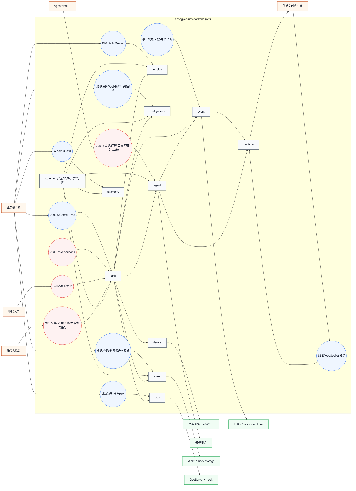
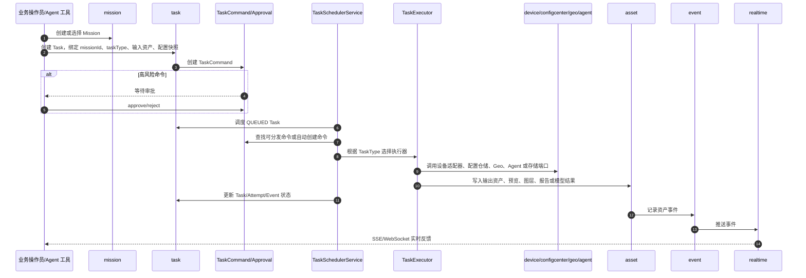

# 后端模块用例图与关系说明

本文根据当前工程代码结构整理，范围为 `com.zhongyan.uav` 下已经落地的新模块。项目对外通过 `server.servlet.context-path=/v2` 暴露接口；默认 profile 使用 mock repository、mock device、mock storage、mock GeoServer，`local` profile 才启用 PostgreSQL/Flyway、Redis、Kafka、MinIO、GeoServer 等本地依赖。

## 1. 总体用例图

> Mermaid 没有原生 UML 用例图语法，这里使用 `flowchart` 表达参与者、用例和模块边界。括号节点表示业务用例，矩形节点表示模块或外部依赖。

## 2. 核心模块关系图

```mermaid
flowchart TB
    subgraph Api["API 层"]
        MissionApi[MissionController]
        TaskApi[Task/Command/Approval/Event/Attempt Controllers]
        ConfigApi[ConfigCenter Controllers]
        AssetApi[Asset/AssetLayer Controllers]
        TelemetryApi[UavTelemetryController]
        EventApi[EventDiagnosticsController]
        RealtimeApi[RealtimeController]
        AgentApi[Agent/AgentTool Controllers]
        AuthApi[AuthController]
    end

    subgraph App["Application 层"]
        MissionApp[MissionApplicationService / QueryService]
        TaskApp[TaskApplicationService / QueryService / Command / Approval / Scheduler]
        ConfigApp[Device/Camera/Model/Transfer Config Services]
        AssetApp[AssetApplicationService / Query / Preview]
        GeoApp[GeoBoundaryApplicationService / LayerPublishApplicationService]
        TelemetryApp[UavTelemetryIngestService / QueryService]
        EventApp[OutboxPublishService / EventReplay / DeadLetter]
        RealtimeApp[RealtimePushService]
        AgentApp[AgentApplicationService / ToolGateway / RAG / ReportDraft]
        DeviceApp[DeviceCommandService]
    end

    subgraph Domain["Domain / Port"]
        MissionRepo[MissionRepository]
        TaskRepos[Task/Command/Event/Attempt Repositories]
        AssetRepos[AssetRepository / TaskAssetRepository]
        ConfigRepos[Config Repositories]
        TelemetryRepo[UavTelemetryRepository]
        OutboxRepo[OutboxRepository / EventPublisher]
        DevicePorts[Camera/Model/Transfer/Command Ports]
        GeoPorts[GroundElevationPort / GeoServerPort]
        AgentPorts[ChatModel / Embedding / VectorStore / AgentTool Ports]
        StoragePort[AssetStoragePort / PreviewGeneratorPort]
    end

    subgraph Infra["Infrastructure"]
        Jpa[JPA repositories]
        Mock[InMemory/mock implementations]
        SshHttp[SSH/HTTP device adapters]
        Minio[MinIO adapter]
        Kafka[Kafka publisher/consumer]
        Redis[Redis runtime guard]
        PgVector[PostgreSQL pgvector]
        SpringAI[Spring AI OpenAI-compatible adapters]
        SseWs[SSE/WebSocket]
        GeoInfra[GeoServer/mock adapters]
    end

    MissionApi --> MissionApp --> MissionRepo
    TaskApi --> TaskApp --> TaskRepos
    ConfigApi --> ConfigApp --> ConfigRepos
    AssetApi --> AssetApp --> AssetRepos
    AssetApi --> GeoApp
    TelemetryApi --> TelemetryApp --> TelemetryRepo
    EventApi --> EventApp --> OutboxRepo
    RealtimeApi --> RealtimeApp
    AgentApi --> AgentApp --> AgentPorts
    AuthApi --> MissionApi

    TaskApp --> MissionRepo
    TaskApp --> AssetRepos
    TaskApp --> DevicePorts
    TaskApp --> ConfigRepos
    TaskApp --> AgentApp
    TaskApp --> StoragePort
    TaskApp --> EventApp
    DeviceApp --> DevicePorts
    GeoApp --> GeoPorts
    GeoApp --> AssetRepos
    TelemetryApp --> EventApp
    AssetApp --> EventApp
    AgentApp --> MissionRepo
    AgentApp --> TaskRepos
    AgentApp --> AssetRepos
    AgentApp --> TelemetryRepo
    AgentApp --> EventApp
    EventApp --> RealtimeApp

    MissionRepo --> Jpa
    MissionRepo --> Mock
    TaskRepos --> Jpa
    TaskRepos --> Mock
    AssetRepos --> Jpa
    AssetRepos --> Mock
    ConfigRepos --> Jpa
    ConfigRepos --> Mock
    TelemetryRepo --> Jpa
    TelemetryRepo --> Mock
    OutboxRepo --> Jpa
    OutboxRepo --> Mock
    EventApp --> Kafka
    RealtimeApp --> SseWs
    DevicePorts --> SshHttp
    DevicePorts --> Mock
    StoragePort --> Minio
    StoragePort --> Mock
    GeoPorts --> GeoInfra
    AgentPorts --> SpringAI
    AgentPorts --> PgVector
    AgentApp --> Redis
```

## 3. 核心业务链路

## 4. 模块职责与关系

| 模块 | 主要入口 | 核心职责 | 主要依赖/被依赖 |
| --- | --- | --- | --- |
| `common` | `SecurityConfig`、统一响应、异常处理、配置装配 | 提供安全基线、统一返回、错误处理、Bean 装配 | 被所有 API/Application 模块复用 |
| `mission` | `MissionController`、`MissionApplicationService`、`MissionQueryService` | 管理任务场景和业务区域，是 Task 的上级业务容器 | Task 创建时校验/关联 Mission；Agent 可查询 Mission |
| `task` | `TaskController`、`TaskCommandController`、`TaskApprovalController`、`TaskSchedulerService` | 系统最小可执行业务单元；管理 Task、Command、Event、Attempt、审批和调度 | 依赖 Mission、ConfigCenter、Device、Asset、Geo、Agent、Event；被 Agent 工具调用 |
| `configcenter` | 设备/相机/模型/传输配置 Controller 与 ApplicationService | 管理设备、相机、模型、传输配置及版本，给 TaskExecutor 提供配置快照来源 | Capture/Process/Transfer 执行器读取配置仓储 |
| `device` | `DeviceCommandService`、Camera/Model/Transfer ports | 隔离真实设备命令和 mock 设备能力 | TaskExecutor 通过端口调用；真实模式落到 SSH/HTTP 适配器 |
| `asset` | `AssetController`、`AssetApplicationService`、`AssetQueryService`、`PreviewApplicationService` | 管理资产、任务资产关系、对象存储引用、预览和删除 | TaskExecutor 写入输出资产；Geo/Agent/Report 读取或生成资产；事件模块记录资产事件 |
| `geo` | `GeoBoundaryApplicationService`、`LayerPublishApplicationService` | 坐标/边界计算、图层发布，隔离 GeoServer 和高程能力 | 依赖 Asset 与 GeoServer/GroundElevation 端口；AssetLayerController 触发图层发布 |
| `telemetry` | `UavTelemetryController`、`UavTelemetryIngestService`、`UavTelemetryQueryService` | 遥测写入、查询、UDP/Kafka/mock 输入 | 写入后通过 Event/Realtime 通知；Agent 工具可查询遥测 |
| `event` | `EventDiagnosticsController`、`OutboxPublishService`、`EventReplayService` | Outbox、Kafka/mock 发布、回放、死信诊断 | Asset、Telemetry、Agent 等模块发布事件；Realtime 消费并推送 |
| `realtime` | `RealtimeController`、`RealtimePushService`、SSE/WebSocket 实现 | 对前端提供实时推送通道 | Event 和 Agent 事件通过 RealtimePushService 推送 |
| `agent` | `AgentController`、`AgentToolController`、`AgentApplicationService`、`ToolGatewayService` | Agent 会话、消息、RAG、报告草稿、工具网关、审计与审批 | 只通过 Tool Gateway 调用 Mission/Task/Asset/Telemetry 等能力；模型调用走 Spring AI/OpenAI-compatible port |

## 5. TaskExecutor 与模块映射

| TaskType | 执行器 | 触达模块/端口 | 产物 |
| --- | --- | --- | --- |
| `CAPTURE` | `CaptureTaskExecutor` | `CameraAdapter`、`CameraConfigRepository` | 设备执行结果、Attempt 日志 |
| `PROCESS` | `ProcessTaskExecutor` | `ModelAdapter`、`ModelConfigRepository` | 设备/模型执行结果、Attempt 日志 |
| `TRANSFER` | `TransferTaskExecutor` | `TransferAdapter`、`TransferConfigRepository` | 传输执行结果、Attempt 日志 |
| `CALCULATE_GEO_BOUNDARY` | `GeoBoundaryTaskExecutor` | `AssetRepository`、`TaskAssetRepository` | `GEOMETRY` 资产 |
| `GENERATE_PREVIEW` | `PreviewTaskExecutor` | `AssetRepository`、`TaskAssetRepository` | `PREVIEW` 图片资产 |
| `PUBLISH_LAYER` | `PublishLayerTaskExecutor` | `AssetRepository`、`TaskAssetRepository` | `LAYER` 资产和 layer URL |
| `DEMO_PLAYBACK` | `DemoPlaybackTaskExecutor` | `AssetRepository`、`TaskAssetRepository` | 演示回放附件 |
| `AGENT_ANALYSIS` | `AgentAnalysisTaskExecutor` | `AgentApplicationService`、资产仓储 | Agent 分析 JSON 资产 |
| `REPORT_GENERATION` | `ReportGenerationTaskExecutor` | `AssetStoragePort`、资产仓储 | Markdown 报告资产 |

## 6. Agent 工具关系

Agent 模块不直接绕过系统能力。`ToolGatewayService` 是 Agent 调用系统能力的统一入口，负责工具选择、权限校验、输入 schema 校验、审批状态、幂等、审计记录和事件发布。当前已装配的工具关系如下：

| 工具 | 依赖模块 | 说明 |
| --- | --- | --- |
| `MissionQueryTool` | `mission` | 查询 Mission 上下文 |
| `TaskQueryTool` | `task` | 查询 Task、Command、Event、Attempt |
| `TaskCreateTool` | `task` | 创建 Task |
| `TaskCommandCreateTool` | `task` | 创建 TaskCommand，高风险写操作仍进入审批链路 |
| `AssetSearchTool` | `asset` | 查询资产 |
| `AssetStatsTool` | `asset` | 统计资产 |
| `TelemetryQueryTool` | `telemetry` | 查询遥测 |
| `DiagnosisReadTaskLogTool` | `task` | 读取任务诊断日志和事件 |
| `ReportGenerateDraftTool` | `agent`、`task` | 基于 RAG/上下文生成报告草稿，并可创建后续报告任务 |

## 7. Profile 与外部依赖边界

| 环境 | 仓储/设备 | 外部依赖 |
| --- | --- | --- |
| 默认 `application.yml` | 排除 DataSource/Flyway，默认走 mock 仓储和 mock 设备能力 | 不应依赖真实 PostgreSQL、Kafka、Redis、MinIO、GeoServer、模型服务或真实设备 |
| `test` | `bms.repository.mode=mock`、`bms.device-mode=mock`，关闭 Flyway、真实 Agent、UDP、Kafka、GeoServer、对象存储 | 适合单元测试和应用服务测试，不代表 real profile 验收 |
| `local` | `bms.repository.mode=jpa`，启用 PostgreSQL/Flyway、Redis、Kafka、MinIO、GeoServer；设备默认仍为 mock | 用于本地真实基础设施验收 |
| `agent-local` / `agent-online` | 启用真实 Agent 模型调用 | 模型服务、Redis runtime guard、Agent 事件需要单独验收 |

## 8. 设计约束摘要

- 新接口只走 `/v2` 上下文，不恢复旧路径。
- 真实设备启动、停止、删除、发布、覆盖等高风险动作必须经过 `TaskCommand` 和审批链路。
- Agent 写操作必须通过 `ToolGatewayService`，并形成可审计、可回放的工具调用记录。
- Domain 层只保留业务模型和仓储/端口抽象，不依赖 Spring、JPA、Kafka、Redis、MinIO、GeoServer、SSH、HTTP 或文件系统。
- `static/images` 是历史业务数据目录，不作为新业务主存储；资产主路径应走 `AssetStoragePort`，本地真实 profile 可落到 MinIO。
- mock 环境只说明业务链路可跑通，不说明 PostgreSQL、Kafka、Redis、MinIO、GeoServer、模型服务或真实设备已经验收。

